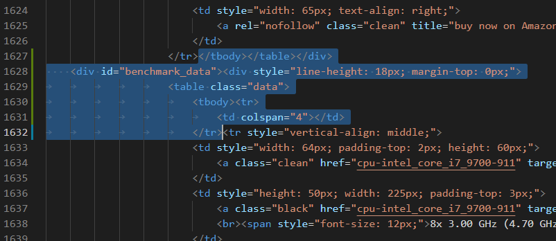
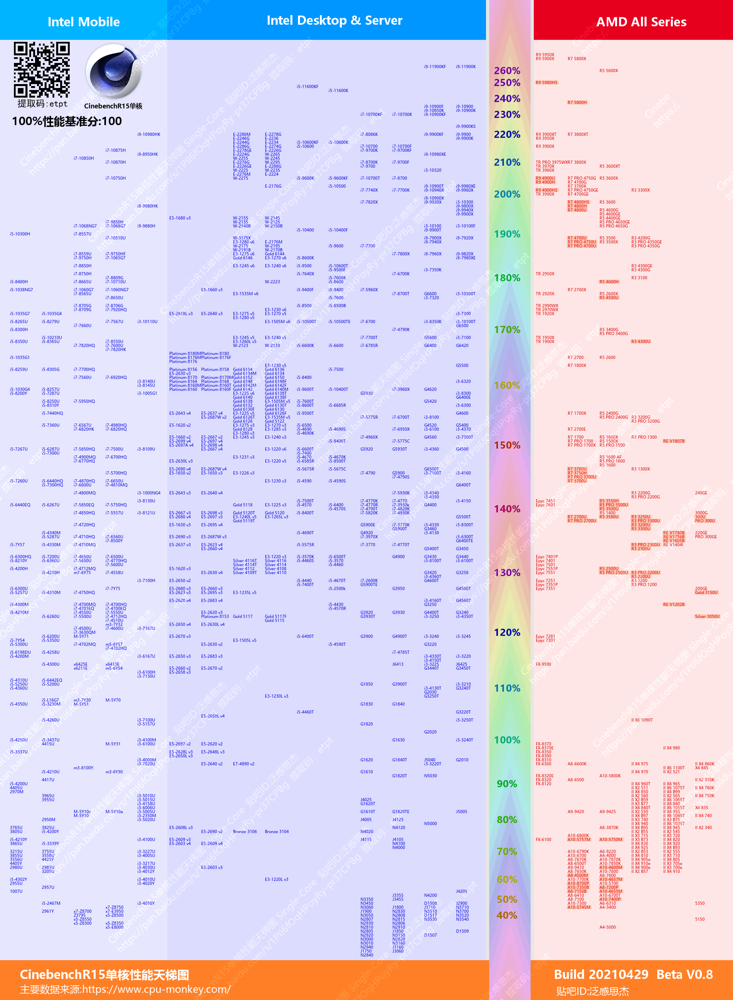

<font color=#A52A2A size=6>CinebenchR15_R20系列停更说明</font>

由于 https://www.cpu-monkey.com 不再开放全部CPU数据，只开放最高性能的250款CPU数据。故暂时停更。
以后有可能只做250款CPU的图，也许不做，如果有更好数据源就做。

# CPU_benchmarkRanking

Download the cpu benchmark data(single core & multi core) from `cpu-monkey.com` & `geekbench.com` and Generate to picture.

---
## Env: Windows10 + Python3

You need change the value of var `fontFile `(path to fontfile:" xxx.ttc") to run on other systems.

Lib request: ` OpenCV, BeautifulSoup, numpy, matplotlib, scipy, PIL ` 

``` sh
python3 -m pip install --upgrade pip
pip install numpy
pip install scipy
pip install matplotlib
pip install opencv-python
pip install beautifulsoup4
```
___
## For Geekbench5:
1. run `download_gb5.py` to download cpu bench date from website, it will parsing data and save to file `data/all_list.txt`
3. run `draw_gb5.py` to generate a chart pictrue in directory `output/`.

In `draw_gb5.py `, change the value of var `coreType`(`'single'` or other ) to set whether to generate a single-core graph or a multi-core graph.
___
## For CinebenchR15 and R20

`cpu-monkey.com` Need to manually download `.html` file first.

1. open the 4 link(at the bottom) by chrome, click the `[show more results]`.
2. press F12, right click the `<html lang='en'>` tag, copy element, save to plainText file `data/` `r15_single.html`, `r15_multi.html`, `r20_single.html`, `r20_multi.html`.
3. Edit those html file, locate to line 1617(about), delete those selected text: 


Now run `download_r15.py` and `draw_r15.py ` in order.

Or run `download_r20.py` and `draw_r20.py `.


---
# Date source：

### CinebenchR15
https://www.cpu-monkey.com/en/cpu_benchmark-cinebench_r15_single_core-7

https://www.cpu-monkey.com/en/cpu_benchmark-cinebench_r15_multi_core-8

### CinebenchR20
https://www.cpu-monkey.com/en/cpu_benchmark-cinebench_r20_single_core-9

https://www.cpu-monkey.com/en/cpu_benchmark-cinebench_r20_multi_core-10

### Geekbench 5
https://browser.geekbench.com/processor-benchmarks

---
---
# Result

