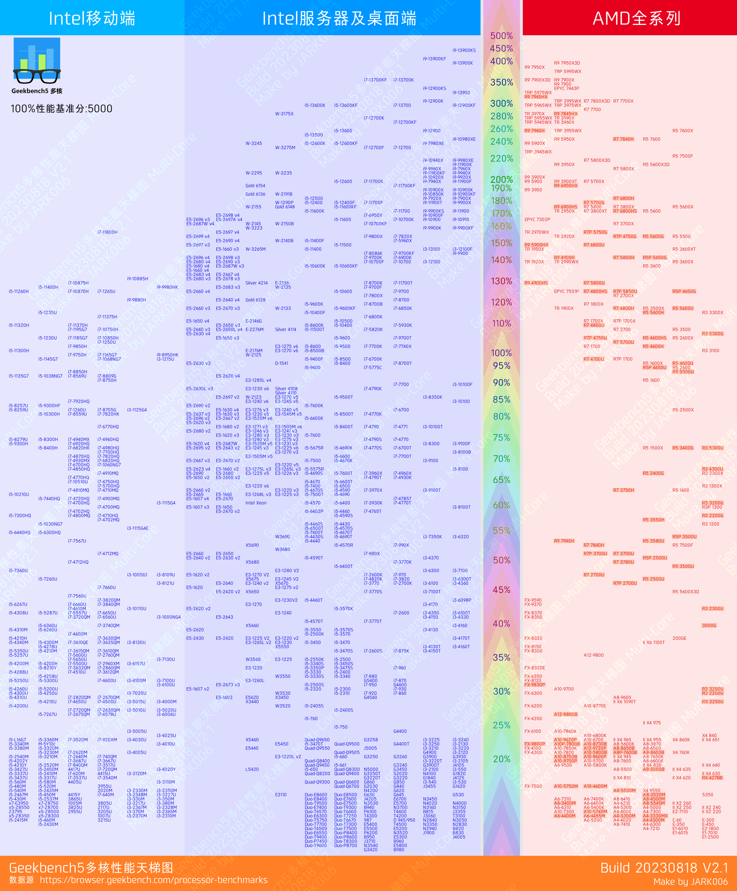

# CPU性能天梯图 CPU_benchmarkRanking

从 `geekbench.com` 下载 cpu 基准数据（单核和多核）并生成图片。

Download cpu benchmark data (single-core and multi-core) from `geekbench.com` and generate images.


## Python库:

``` sh
pip install numpy scipy matplotlib opencv-python beautifulsoup4 pillow
```

## 说明

1. 运行`draw_gb5.py`将生成图片到目录 `output/`。
1. Run `draw_gb5.py` will generate images to the directory `output/`.

# Geekbench source
https://browser.geekbench.com/processor-benchmarks

---
# Result 最终效果

