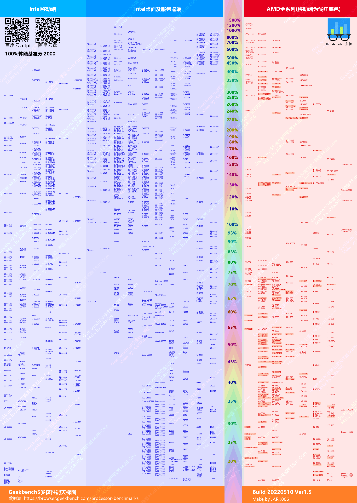

# CPU性能天梯图 CPU_benchmarkRanking

从 `cpu-monkey.com` & `geekbench.com` 下载 cpu 基准数据（单核和多核）并生成图片。

Download cpu benchmark data (single-core and multi-core) from `cpu-monkey.com` & `geekbench.com` and generate images.


---
## Env & 环境: Windows10 + Python3

你也许需要更改 变量 `fontFile `(fontfile 的路径："xxx.ttc") 的值才能在其他系统上运行。

You may need change the value of var `fontFile `(path to fontfile:" xxx.ttc") to run on other systems.

Lib request & 库要求: ` numpy, scipy, matplotlib, OpenCV, BeautifulSoup, Pillow ` 

``` sh
python -m pip install --upgrade pip
pip install numpy scipy matplotlib opencv-python beautifulsoup4 pillow

# 速度慢就用临时阿里云代理
pip install -i https://mirrors.aliyun.com/pypi/simple/ numpy scipy matplotlib opencv-python beautifulsoup4 pillow
```
___
## 对于 Geekbench5：
1. 运行`draw_gb5.py`。
2. 图像和日志将在目录 `output/` 中生成。
## For Geekbench5:
1. Rrun `draw_gb5.py`.
2. The chart image and log will generate in directory `output/`.

___

<font color=#A52A2A size=4>CinebenchR15_R20系列停更说明</font>

由于 https://www.cpu-monkey.com 不再开放全部CPU数据，只开放最高性能的250款CPU数据。故暂时停更。
以后有可能只做250款CPU的图，也许不做，如果有更好数据源就做。
## ~~For CinebenchR15 and R20~~

~~`cpu-monkey.com` Need to manually download `.html` file first.~~

~~1. open the 4 link(at the bottom) by chrome, click the `[show more results]`.~~
~~2. press F12, right click the `<html lang='en'>` tag, copy element, save to plainText file `data/` `r15_single.html`, `r15_multi.html`, `r20_single.html`, `r20_multi.html`.~~

~~3. Edit those html file, locate to line 1617(about), delete those selected text:~~


~~Now run `download_r15.py` and `draw_r15.py ` in order.~~

~~Or run `download_r20.py` and `draw_r20.py `.~~


---
# Date source：

### CinebenchR15
https://www.cpu-monkey.com/en/cpu_benchmark-cinebench_r15_single_core-7

https://www.cpu-monkey.com/en/cpu_benchmark-cinebench_r15_multi_core-8

### CinebenchR20
https://www.cpu-monkey.com/en/cpu_benchmark-cinebench_r20_single_core-9

https://www.cpu-monkey.com/en/cpu_benchmark-cinebench_r20_multi_core-10

### Geekbench 5
https://browser.geekbench.com/processor-benchmarks

---
---
# Result 最终效果

