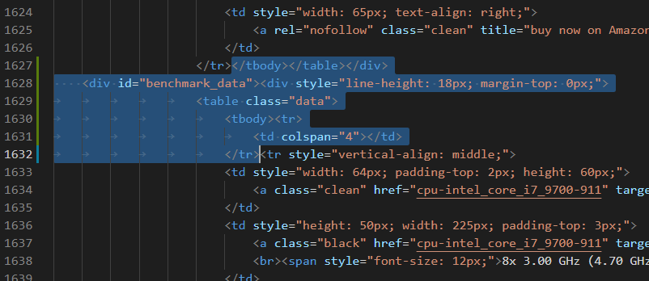

# cpu_benchmarkRanking

### Lang: Python3.X

### System: Windows10

### You need change the value of var `fontFile `(path to fontfile:" xxx.ttc") to run on other systems.

### Lib request: ` OpenCV, BeautifulSoup, numpy, matplotlib, scipy, PIL ` 
___
## Steps:
1. cd to one of those directory, such as  `cd ./geekbench5`;
2. run `download_data.py` to download cpu bench date from website, it will parsing data and save to file 'all_list.txt'
3. run `generateBenchPic.py` to generate a chart pictrue in this directory.

In `generateBenchPic.py `, change the value of var `coreType`(`'single'` or other ) to set whether to generate a single-core graph or a multi-core graph.
___
### 2021/03/28 update:

`cpu-monkey.com` Need to manually download web pages first.

1. cd to `cinebenchr20` or `cinebenchr15` .
2. open the link(at the bottom) by chrome, click the `[show more results]`.
3. press F12 to copy all html text and save to `single.html` or `multi.html`.
4. Edit `single.html` and `multi.html`, locate to line 1627(about), delete those selected text: 
4. Now run `download_data.py` and `generateBenchPic.py `.
----
----
# Date source：

## CinebenchR15

https://www.cpu-monkey.com/en/cpu_benchmark-cinebench_r15_single_core-7

https://www.cpu-monkey.com/en/cpu_benchmark-cinebench_r15_multi_core-8

## CinebenchR20

https://www.cpu-monkey.com/en/cpu_benchmark-cinebench_r20_single_core-9

https://www.cpu-monkey.com/en/cpu_benchmark-cinebench_r20_multi_core-10'

## Geekbench 5

https://browser.geekbench.com/processor-benchmarks

